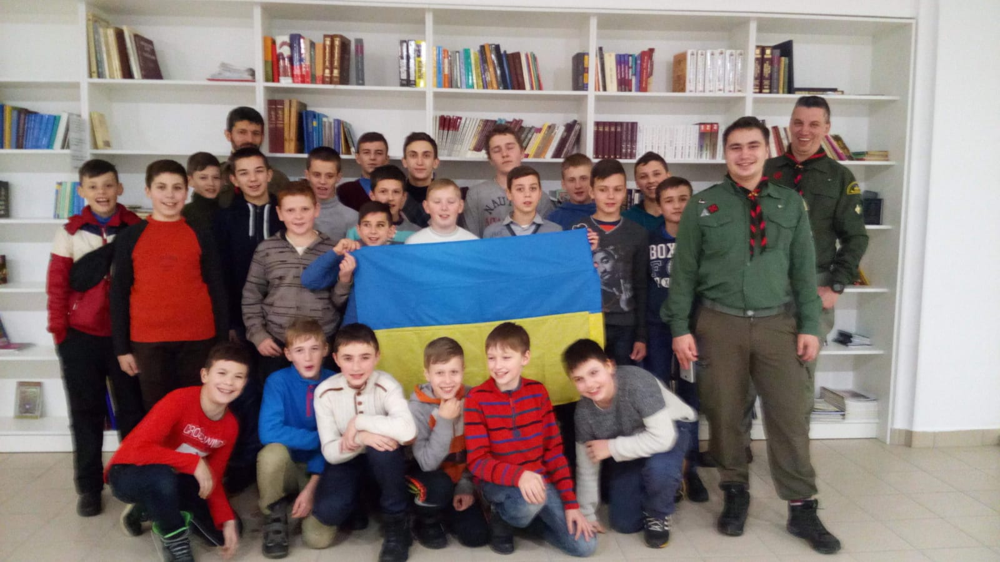

<!DOCTYPE html>
<html lang="uk">
<head>
    <meta charset="UTF-8">
    <meta name="viewport" content="width=device-width, initial-scale=1.0">
    <title>Курінь 117 ім. Івана Чмоли</title>
    
</head>
<body>
    <header>
        <h1>Курінь 117 ім. Івана Чмоли</h1>
    </header>
    <nav>
        <a href="javascript:void(0);" onclick="showSection('home')">Головна</a> | 
        <a href="javascript:void(0);" onclick="showSection('history')">Історія</a> | 
        <a href="javascript:void(0);" onclick="showSection('achievements')">Досягнення</a> | 
        <a href="javascript:void(0);" onclick="showSection('posts')">Дописи</a>
    </nav>
    

        <!-- Головна -->
        

            <h2>Ласкаво просимо до Куреня!</h2>
            
Наш курінь 117 ім. Івана Чмоли — це спільнота молодих людей, які поєднують військову дисципліну з пластовими традиціями.

        

        <!-- Історія -->
        

            <h2>Історія Куреня</h2>
            
Курінь 117 ім. Івана Чмоли був заснований у 2017 році трьома однодумцями: Романом Трухіним, Ростиславом Антимисом та Кравцем Остапом. Метою їх створення було поєднання військової спеціалізації та пластунської діяльності.

            

                
            

        

        <!-- Досягнення -->
        

            <h2>Досягнення</h2>
            
Ми пишаємось своїми успіхами у таборуванні, мандрівках та змаганнях.

        

        <!-- Дописи -->
        

            <h2>Дописи</h2>
            
Тут з'являтимуться новини та цікаві історії з життя куреня.

        

    

    <footer>
        
© 2025 Курінь 117 ім. Івана Чмоли

    </footer>

    
</body>
</html>
